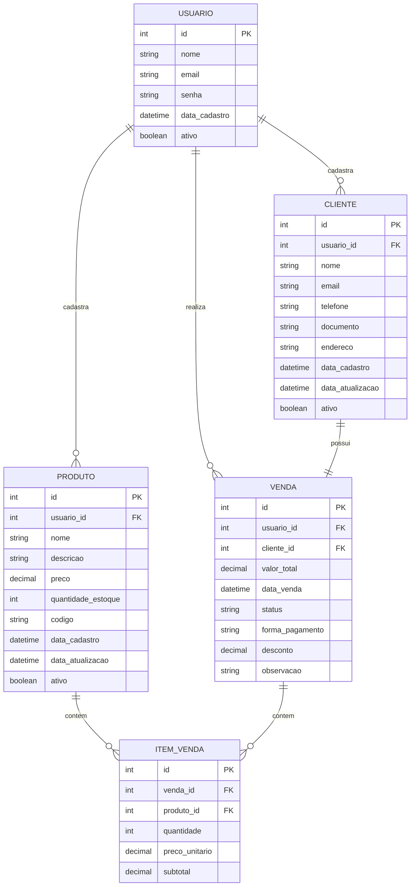

# Sistema de Cadastro de Produtos - Regras de Negócio (MVP)

## 1. Visão Geral

Este documento define as regras de negócio para um sistema básico (MVP) de cadastro de produtos com controle de estoque, vendas e clientes. O sistema permitirá gerenciar produtos, clientes, estoque e vendas, com a restrição de que cada usuário só pode ver o que ele mesmo cadastrou.

## 2. Entidades e Relacionamentos

### Diagrama de Entidade-Relacionamento (ER)

## 3. Regras de Negócio

### 3.1. Usuários

1. Cada usuário deve ter credenciais únicas para acessar o sistema.
2. Um usuário só pode visualizar e gerenciar os registros que ele mesmo cadastrou.
3. O sistema deve registrar qual usuário cadastrou cada registro no sistema.

### 3.2. Produtos

1. Todo produto deve ter um nome, código único, preço e quantidade em estoque.
2. O estoque do produto deve ser atualizado automaticamente após cada venda.
3. Não deve ser permitido vender uma quantidade maior que a disponível em estoque.
4. Um produto pode ser marcado como inativo, mas não pode ser excluído se estiver vinculado a alguma venda.
5. Deve ser possível rastrear o histórico de atualizações de estoque.

### 3.3. Clientes

1. Todo cliente deve ter nome e pelo menos um contato (email ou telefone).
2. O documento do cliente (CPF/CNPJ) deve ser único no sistema para cada usuário.
3. Um cliente pode ser marcado como inativo, mas não excluído se possuir vendas vinculadas.

### 3.4. Vendas

1. Uma venda deve estar sempre associada a um cliente e a um usuário que a realizou.
2. Uma venda deve conter pelo menos um item (produto).
3. O valor total da venda deve ser calculado automaticamente com base nos itens adicionados.
4. Ao finalizar uma venda, o estoque dos produtos deve ser atualizado automaticamente.
5. Uma venda pode ter os seguintes status: "Em andamento", "Finalizada", "Cancelada".
6. Uma venda finalizada não pode ser alterada, apenas cancelada.
7. Ao cancelar uma venda, o estoque dos produtos deve ser restaurado.

### 3.5. Itens de Venda

1. Cada item de venda deve estar associado a um produto e a uma venda.
2. O preço unitário do item de venda deve ser o preço atual do produto no momento da venda.
3. O subtotal do item deve ser calculado automaticamente (preço unitário × quantidade).
4. Não é possível adicionar uma quantidade de itens maior que a disponível em estoque.

## 4. Operações CRUD

### 4.1. Produtos

- **Criar**: Registrar um novo produto com informações básicas e estoque inicial.
- **Ler**: Listar todos os produtos cadastrados pelo usuário atual ou buscar detalhes de um produto específico.
- **Atualizar**: Modificar informações do produto, incluindo preço e quantidade em estoque.
- **Desativar**: Marcar um produto como inativo (soft delete).

### 4.2. Clientes

- **Criar**: Registrar um novo cliente com informações de contato.
- **Ler**: Listar todos os clientes cadastrados pelo usuário atual ou buscar detalhes de um cliente específico.
- **Atualizar**: Modificar informações de contato ou endereço do cliente.
- **Desativar**: Marcar um cliente como inativo (soft delete).

### 4.3. Vendas

- **Criar**: Iniciar uma nova venda para um cliente, adicionar itens e finalizar.
- **Ler**: Listar todas as vendas realizadas pelo usuário atual ou visualizar detalhes de uma venda específica.
- **Atualizar**: Modificar uma venda em andamento (adicionar/remover itens, alterar quantidades).
- **Cancelar**: Cancelar uma venda (deve restaurar o estoque).

## 5. Relatórios Básicos (MVP)

1. Listagem de produtos com estoque baixo.
2. Vendas realizadas por período.
3. Histórico de compras por cliente.
4. Produtos mais vendidos.

## 6. Considerações Técnicas

1. Toda operação crítica deve ser registrada em log.
2. O sistema deve implementar validações para todas as regras de negócio descritas.
3. Devem ser implementadas medidas de segurança para garantir que um usuário não acesse dados de outro usuário.
4. O banco de dados deve garantir a integridade referencial entre as entidades.

## 7. Fluxo Básico de Uso

1. Usuário faz login no sistema.
2. Cadastra produtos e define estoque inicial.
3. Cadastra clientes.
4. Cria uma nova venda:
   - Seleciona um cliente.
   - Adiciona produtos e quantidades.
   - Finaliza a venda.
5. O sistema atualiza automaticamente o estoque.
6. O usuário pode consultar histórico de vendas e produtos.

## 8. Próximos Passos (Pós-MVP)

1. Implementar sistema de permissões mais granular.
2. Adicionar gestão de fornecedores.
3. Implementar sistema de alertas para estoque baixo.
4. Desenvolver dashboard com indicadores de desempenho.
5. Implementar funcionalidade de devoluções.