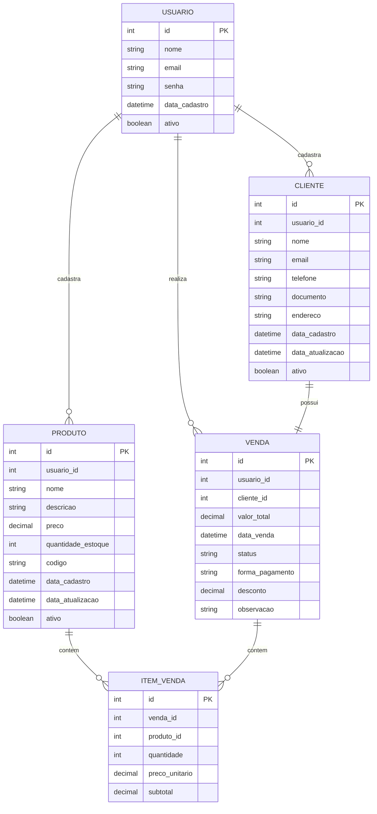
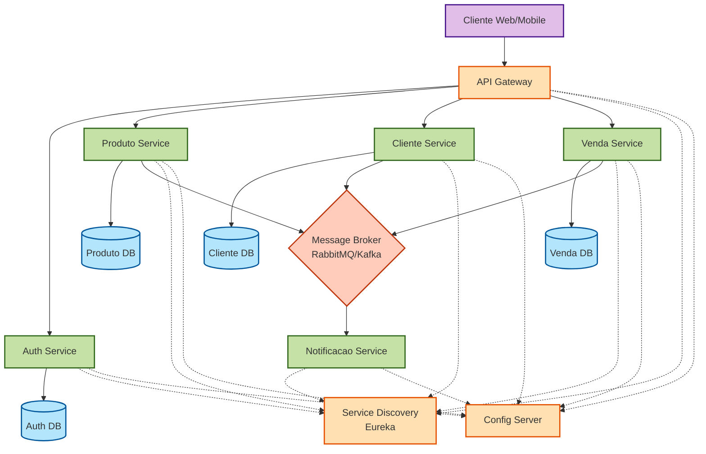
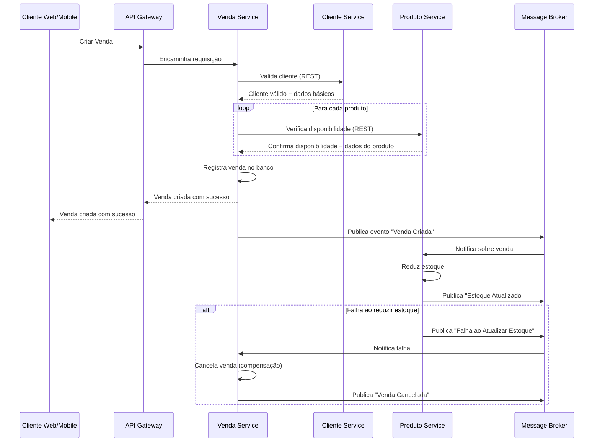

# Sistema de Cadastro de Produtos - Arquitetura Completa

## Detalhes do Projeto
[DOC](./DOC.md)

## 🛠️ Tecnologias Utilizadas

- Java 21 - Aproveitando recursos como Virtual Threads
- Spring Boot 3 - Base para desenvolvimento dos microserviços
- Spring Cloud - Suite de ferramentas para sistemas distribuídos
    - Spring Cloud Gateway - API Gateway
    - Spring Cloud Netflix Eureka - Service Discovery
    - Spring Cloud Config - Configuração centralizada
- PostgreSQL - Banco de dados relacional
- Docker - Containerização
- Maven - Gerenciamento de dependências

## 🛣️ Roadmap

- [x] Design inicial da arquitetura
- [x] Implementação da infraestrutura básica (Config Server, Service Discovery, API Gateway)
- [ ] Implementação do Auth Service
- [ ] Implementação do Produto Service
- [ ] Implementação do Cliente Service
- [ ] Implementação do Venda Service
- [ ] Implementação da mensageria entre serviços
- [ ] Implementação do Notificação Service
- [ ] Deploy em ambiente de produção

## Parte 1: Regras de Negócio (MVP)

### 1. Visão Geral

Este documento define as regras de negócio para um sistema básico (MVP) de cadastro de produtos com controle de estoque, vendas e clientes. O sistema permitirá gerenciar produtos, clientes, estoque e vendas, com a restrição de que cada usuário só pode ver o que ele mesmo cadastrou.

### 2. Entidades e Relacionamentos

#### Diagrama de Entidade-Relacionamento (ER)



### 3. Regras de Negócio

#### 3.1. Usuários

1. Cada usuário deve ter credenciais únicas para acessar o sistema.
2. Um usuário só pode visualizar e gerenciar os registros que ele mesmo cadastrou.
3. O sistema deve registrar qual usuário cadastrou cada registro no sistema.

#### 3.2. Produtos

1. Todo produto deve ter um nome, código único, preço e quantidade em estoque.
2. O estoque do produto deve ser atualizado automaticamente após cada venda.
3. Não deve ser permitido vender uma quantidade maior que a disponível em estoque.
4. Um produto pode ser marcado como inativo, mas não pode ser excluído se estiver vinculado a alguma venda.
5. Deve ser possível rastrear o histórico de atualizações de estoque.

#### 3.3. Clientes

1. Todo cliente deve ter nome e pelo menos um contato (email ou telefone).
2. O documento do cliente (CPF/CNPJ) deve ser único no sistema para cada usuário.
3. Um cliente pode ser marcado como inativo, mas não excluído se possuir vendas vinculadas.

#### 3.4. Vendas

1. Uma venda deve estar sempre associada a um cliente e a um usuário que a realizou.
2. Uma venda deve conter pelo menos um item (produto).
3. O valor total da venda deve ser calculado automaticamente com base nos itens adicionados.
4. Ao finalizar uma venda, o estoque dos produtos deve ser atualizado automaticamente.
5. Uma venda pode ter os seguintes status: "Em andamento", "Finalizada", "Cancelada".
6. Uma venda finalizada não pode ser alterada, apenas cancelada.
7. Ao cancelar uma venda, o estoque dos produtos deve ser restaurado.

#### 3.5. Itens de Venda

1. Cada item de venda deve estar associado a um produto e a uma venda.
2. O preço unitário do item de venda deve ser o preço atual do produto no momento da venda.
3. O subtotal do item deve ser calculado automaticamente (preço unitário × quantidade).
4. Não é possível adicionar uma quantidade de itens maior que a disponível em estoque.

### 4. Operações CRUD

#### 4.1. Produtos

- **Criar**: Registrar um novo produto com informações básicas e estoque inicial.
- **Ler**: Listar todos os produtos cadastrados pelo usuário atual ou buscar detalhes de um produto específico.
- **Atualizar**: Modificar informações do produto, incluindo preço e quantidade em estoque.
- **Desativar**: Marcar um produto como inativo (soft delete).

#### 4.2. Clientes

- **Criar**: Registrar um novo cliente com informações de contato.
- **Ler**: Listar todos os clientes cadastrados pelo usuário atual ou buscar detalhes de um cliente específico.
- **Atualizar**: Modificar informações de contato ou endereço do cliente.
- **Desativar**: Marcar um cliente como inativo (soft delete).

#### 4.3. Vendas

- **Criar**: Iniciar uma nova venda para um cliente, adicionar itens e finalizar.
- **Ler**: Listar todas as vendas realizadas pelo usuário atual ou visualizar detalhes de uma venda específica.
- **Atualizar**: Modificar uma venda em andamento (adicionar/remover itens, alterar quantidades).
- **Cancelar**: Cancelar uma venda (deve restaurar o estoque).

### 5. Relatórios Básicos (MVP)

1. Listagem de produtos com estoque baixo.
2. Vendas realizadas por período.
3. Histórico de compras por cliente.
4. Produtos mais vendidos.

### 6. Considerações Técnicas

1. Toda operação crítica deve ser registrada em log.
2. O sistema deve implementar validações para todas as regras de negócio descritas.
3. Devem ser implementadas medidas de segurança para garantir que um usuário não acesse dados de outro usuário.
4. O banco de dados deve garantir a integridade referencial entre as entidades.

### 7. Fluxo Básico de Uso

1. Usuário faz login no sistema.
2. Cadastra produtos e define estoque inicial.
3. Cadastra clientes.
4. Cria uma nova venda:
   - Seleciona um cliente.
   - Adiciona produtos e quantidades.
   - Finaliza a venda.
5. O sistema atualiza automaticamente o estoque.
6. O usuário pode consultar histórico de vendas e produtos.

### 8. Próximos Passos (Pós-MVP)

1. Implementar sistema de permissões mais granular.
2. Adicionar gestão de fornecedores.
3. Implementar sistema de alertas para estoque baixo.
4. Desenvolver dashboard com indicadores de desempenho.
5. Implementar funcionalidade de devoluções.

## Parte 2: Arquitetura de Microserviços (Java 21 + Spring Boot 3)

### 1. Visão Geral da Arquitetura

Este documento apresenta uma arquitetura baseada em microserviços para o sistema de cadastro de produtos, utilizando Java 21 e Spring Boot 3. A arquitetura foi projetada para ser escalável, resiliente e seguir os princípios modernos de desenvolvimento de software.

### 2. Diagrama da Arquitetura



### 3. Componentes da Arquitetura

#### 3.1. Componentes de Infraestrutura

##### 3.1.1. API Gateway (Spring Cloud Gateway)

- **Função**: Ponto único de entrada para o sistema

- Responsabilidades

  :

  - Roteamento de requisições para os serviços apropriados
  - Autenticação e autorização via JWT
  - Rate limiting e circuit breaker
  - Balanceamento de carga

##### 3.1.2. Service Discovery (Eureka)

- **Função**: Registro e descoberta de serviços

- Responsabilidades

  :

  - Gerenciar localização dinâmica de serviços
  - Facilitar a comunicação entre serviços
  - Balanceamento de carga na camada de cliente

##### 3.1.3. Config Server (Spring Cloud Config)

- **Função**: Centralização de configurações

- Responsabilidades

  :

  - Gerenciar configurações externalizadas
  - Permitir atualizações em tempo real
  - Separar configurações por ambiente (dev, test, prod)

##### 3.1.4. Message Broker (RabbitMQ/Kafka)

- **Função**: Comunicação assíncrona entre serviços

- Responsabilidades

  :

  - Implementar padrão publish-subscribe
  - Garantir entrega de mensagens
  - Desacoplar serviços

#### 3.2. Microserviços

##### 3.2.1. Auth Service

- **Domínio**: Autenticação e autorização

- Responsabilidades

  :

  - Registro e gestão de usuários
  - Autenticação via JWT
  - Controle de acesso baseado em perfis
  - Integração com Auth DB (PostgreSQL)

##### 3.2.2. Produto Service

- **Domínio**: Gestão de produtos e estoque

- Responsabilidades

  :

  - CRUD de produtos
  - Controle de estoque
  - Validações de negócio específicas para produtos
  - Integração com Produto DB (PostgreSQL)
  - Publicação de eventos de produto (criação, atualização, mudança de estoque)

##### 3.2.3. Cliente Service

- **Domínio**: Gestão de clientes

- Responsabilidades

  :

  - CRUD de clientes
  - Validações de negócio específicas para clientes
  - Integração com Cliente DB (PostgreSQL)
  - Publicação de eventos de cliente (criação, atualização)

##### 3.2.4. Venda Service

- **Domínio**: Gestão de vendas

- Responsabilidades

  :

  - CRUD de vendas e itens de venda
  - Processamento de vendas
  - Validações de negócio específicas para vendas
  - Integração com Venda DB (PostgreSQL)
  - Consultas ao Produto Service para verificar estoque
  - Consultas ao Cliente Service para validar cliente
  - Publicação de eventos de venda (criação, finalização, cancelamento)

##### 3.2.5. Notificação Service

- **Domínio**: Envio de notificações

- Responsabilidades

  :

  - Processamento de eventos de outros serviços
  - Envio de notificações por email, SMS, etc.
  - Geração de relatórios

### 4. Bancos de Dados e Gerenciamento de Relacionamentos

#### 4.1. Bancos de Dados por Serviço

Cada microserviço terá seu próprio banco de dados (Database per Service pattern):

1. **Auth DB**: Armazena dados de usuários e permissões
2. **Produto DB**: Armazena dados de produtos e estoque
3. **Cliente DB**: Armazena dados de clientes
4. **Venda DB**: Armazena dados de vendas e itens de venda

Recomendação: PostgreSQL para todos os serviços, facilitando a manutenção.

#### 4.2. Estratégias para Gerenciamento de Relacionamentos

Como cada serviço tem seu próprio banco de dados isolado, não é possível usar chaves estrangeiras tradicionais entre serviços. As seguintes estratégias serão implementadas para gerenciar relacionamentos:

##### 4.2.1. Referências por IDs

- Serviços armazenam apenas os IDs de entidades gerenciadas por outros serviços
- Exemplo: **Venda Service** armazena `cliente_id` sem chave estrangeira formal

##### 4.2.2. Redundância Controlada

- Cópia estratégica de dados que raramente mudam para reduzir chamadas entre serviços
- Exemplo: **Venda Service** armazena `cliente_id`, `cliente_nome` e `cliente_documento` no momento da venda

##### 4.2.3. Sincronização via Eventos

- Quando dados duplicados são atualizados em seu serviço de origem, um evento é publicado
- Serviços que contêm cópias desses dados consomem o evento e atualizam suas cópias
- Exemplo: Quando um cliente muda seu nome no **Cliente Service**, um evento "Cliente Atualizado" é publicado para que o **Venda Service** possa atualizar os registros relevantes

#### 4.3. Modelo de Dados por Serviço

##### 4.3.1. Auth Service DB

```
USUARIO {
    id (PK)
    nome
    email
    senha (hash)
    data_cadastro
    ativo
}

PERFIL {
    id (PK)
    nome
    descricao
}

USUARIO_PERFIL {
    usuario_id (PK)
    perfil_id (PK)
}
```

##### 4.3.2. Produto Service DB

```
PRODUTO {
    id (PK)
    usuario_id
    nome
    descricao
    preco
    quantidade_estoque
    codigo
    data_cadastro
    data_atualizacao
    ativo
}

MOVIMENTO_ESTOQUE {
    id (PK)
    produto_id (FK)
    quantidade
    tipo (entrada/saída)
    motivo
    referencia_id (id da venda ou outra operação)
    data_movimento
}
```

##### 4.3.3. Cliente Service DB

```
CLIENTE {
    id (PK)
    usuario_id
    nome
    email
    telefone
    documento
    endereco
    data_cadastro
    data_atualizacao
    ativo
}
```

##### 4.3.4. Venda Service DB

```
VENDA {
    id (PK)
    usuario_id
    cliente_id (referência, não FK)
    cliente_nome
    cliente_documento
    valor_total
    data_venda
    status
    forma_pagamento
    desconto
    observacao
}

ITEM_VENDA {
    id (PK)
    venda_id (FK)
    produto_id (referência, não FK)
    produto_nome
    produto_codigo
    quantidade
    preco_unitario (no momento da venda)
    subtotal
}
```

### 5. Padrões de Comunicação e Consistência de Dados

#### 5.1. Comunicação Síncrona (REST)

- Entre cliente (frontend) e API Gateway
- Entre API Gateway e microserviços
- Entre microserviços quando necessária resposta imediata
- Usada principalmente para consultas e validações: verificar disponibilidade de estoque, validar cliente

#### 5.2. Comunicação Assíncrona (Mensageria)

- Entre microserviços para operações que não necessitam de resposta imediata
- Para propagação de eventos (Event-Driven Architecture)
- Para operações de longa duração
- Usada principalmente para atualizações de estado: redução de estoque, atualização de dados duplicados

#### 5.3. Padrão SAGA para Transações Distribuídas

Para manter a consistência em operações que envolvem múltiplos serviços (como criar uma venda), será implementado o padrão SAGA:



#### 5.4. Consistência Eventual

O sistema adota o princípio de consistência eventual:

- Os dados podem ficar temporariamente inconsistentes entre serviços
- Mecanismos de sincronização garantem que eventualmente os dados fiquem consistentes
- Cada serviço é responsável por sua própria consistência interna

#### 5.5. Exemplos de Fluxos Entre Serviços

##### 5.5.1. Fluxo de Criação de Venda

1. **Venda Service** recebe requisição para criar venda
2. Valida cliente via **Cliente Service** (síncrono via REST)
3. Recupera e armazena informações básicas do cliente (nome, documento)
4. Para cada produto:
   - Verifica disponibilidade via **Produto Service** (síncrono via REST)
   - Armazena informações do produto necessárias (nome, código, preço)
5. Cria a venda no banco de dados local
6. Publica evento "Venda Criada" via Message Broker
7. **Produto Service** consome evento e atualiza estoque

##### 5.5.2. Fluxo de Atualização de Cliente

1. **Cliente Service** atualiza dados de um cliente
2. Publica evento "Cliente Atualizado" com ID e dados alterados
3. **Venda Service** consome o evento
4. Atualiza dados duplicados nas vendas relevantes

### 6. Segurança

#### 6.1. Autenticação

- JWT (JSON Web Token) para autenticação entre cliente e API Gateway
- OAuth 2.0 para autorização
- Comunicação segura entre serviços

#### 6.2. Autorização

- RBAC (Role-Based Access Control)
- Cada usuário só pode acessar recursos que ele mesmo criou

#### 6.3. Segurança na Comunicação

- TLS/SSL para todas as comunicações
- Secrets gerenciados pelo Config Server

### 7. Desenvolvimento e Implantação

#### 7.1. Tecnologias Principais

- **Java 21**: Aproveitando features como Virtual Threads e Estruturas de Dados Imutáveis
- **Spring Boot 3**: Base para desenvolvimento dos microserviços
- **Spring Cloud**: Para componentes de infraestrutura
- **Maven/Gradle**: Gerenciamento de dependências
- **Docker**: Containerização
- **Kubernetes**: Orquestração (opcional para MVP)

#### 7.2. Padrões de Desenvolvimento

- **Domain-Driven Design (DDD)**: Para modelar domínios complexos
- **CQRS (Command Query Responsibility Segregation)**: Para serviços com operações de leitura intensivas
- **Event Sourcing**: Para manter histórico de alterações em entidades críticas
- **API First**: Definir APIs antes da implementação

#### 7.3. Observabilidade

- **Distributed Tracing**: Spring Cloud Sleuth + Zipkin
- **Métricas**: Prometheus + Grafana
- **Logs Centralizados**: ELK Stack (Elasticsearch, Logstash, Kibana)

### 8. Estratégia de Implementação Gradual

Para facilitar a transição para microserviços, recomenda-se uma abordagem gradual:

#### Fase 1: Infraestrutura Básica

1. Configurar ambiente de desenvolvimento com Docker
2. Implementar Config Server e Service Discovery
3. Implementar API Gateway básico

#### Fase 2: Autenticação e Serviço Inicial

1. Implementar Auth Service
2. Implementar um dos serviços de domínio (ex: Produto Service)
3. Integrar com API Gateway

#### Fase 3: Serviços Principais

1. Implementar demais serviços de domínio
2. Estabelecer comunicação entre serviços

#### Fase 4: Mensageria e Resiliência

1. Implementar Message Broker
2. Refatorar comunicação para padrão Event-Driven
3. Implementar Notificação Service

#### Fase 5: Observabilidade e Otimização

1. Implementar monitoramento e tracing
2. Otimizar performance e resiliência

### 9. Desafios e Considerações

#### 9.1. Desafios Técnicos

##### 9.1.1. Gerenciamento de Relacionamentos Entre Serviços

- **Desafio**: Manter a integridade referencial entre entidades em diferentes serviços sem chaves estrangeiras
- **Solução**: Implementar referências por ID, redundância controlada e sincronização via eventos

##### 9.1.2. Consistência de Dados

- **Desafio**: Manter dados consistentes em uma arquitetura distribuída
- **Solução**: Implementar padrão SAGA para transações distribuídas, aceitar consistência eventual, implementar mecanismos de compensação

##### 9.1.3. Resiliência

- **Desafio**: Lidar com falhas parciais no sistema
- **Solução**: Implementar circuit breakers, rate limiting, retries, e mecanismos de fallback

##### 9.1.4. Rastreabilidade

- **Desafio**: Rastrear transações que passam por múltiplos serviços
- **Solução**: Implementar correlation IDs e distributed tracing (Spring Cloud Sleuth + Zipkin)

##### 9.1.5. Testes

- **Desafio**: Testar efetivamente um sistema distribuído
- **Solução**: Múltiplas estratégias de teste (unitário, integração, contrato, end-to-end), utilizar Contract Testing (Spring Cloud Contract)

#### 9.2. Considerações Organizacionais

##### 9.2.1. Curva de Aprendizado

- **Desafio**: Equipe precisa aprender novas tecnologias e padrões
- **Solução**: Implementação gradual, documentação clara, treinamentos, começar com serviços menos críticos

##### 9.2.2. Complexidade Operacional

- **Desafio**: Operar e dar suporte a múltiplos serviços independentes
- **Solução**: Automação de DevOps, monitoramento centralizado, infraestrutura como código

##### 9.2.3. Sobrecarga de Comunicação

- **Desafio**: Aumento de comunicação de rede e possíveis gargalos
- **Solução**: Uso estratégico de caches, redundância controlada de dados, otimização de APIs

##### 9.2.4. Governança de APIs

- **Desafio**: Manter consistência nas interfaces entre serviços
- **Solução**: Documentação de APIs (Swagger/OpenAPI), versionamento de APIs, contratos de serviço

#### 9.3. Estratégias para Mitigar Riscos

1. **Adoção Incremental**: Iniciar com 2-3 serviços e expandir gradualmente
2. **Monitoramento Avançado**: Implementar desde o início para detectar problemas rapidamente
3. **API Gateway Robusto**: Investir em um gateway que facilite políticas de segurança e roteamento
4. **Documentação Detalhada**: Manter documentação atualizada de cada serviço e suas APIs
5. **Automação de Testes**: Implementar pipelines CI/CD com testes automatizados
6. **Padrões Consistentes**: Utilizar padrões de projeto e implementação consistentes entre serviços

### 10. Conclusão

A arquitetura proposta segue os princípios modernos de microserviços, utilizando Java 21 e Spring Boot 3 como base tecnológica. A abordagem gradual de implementação permite uma transição suave para este paradigma, minimizando riscos e maximizando o aprendizado da equipe.

Este documento serve como um guia inicial e deve ser revisado e refinado conforme o projeto evolui e novos requisitos são identificados.